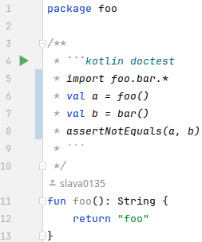

# Doktest Plugin for Intellij IDEA

IDE support for [plugin](https://github.com/Slava0135/doktest) that verifies your Kotlin code inside KDoc comments.

## About

Features:

* Run single test by pressing button
* Doctest heading syntax highlighting and warning annotations
* Kotlin code highlighting inside KDoc code blocks
